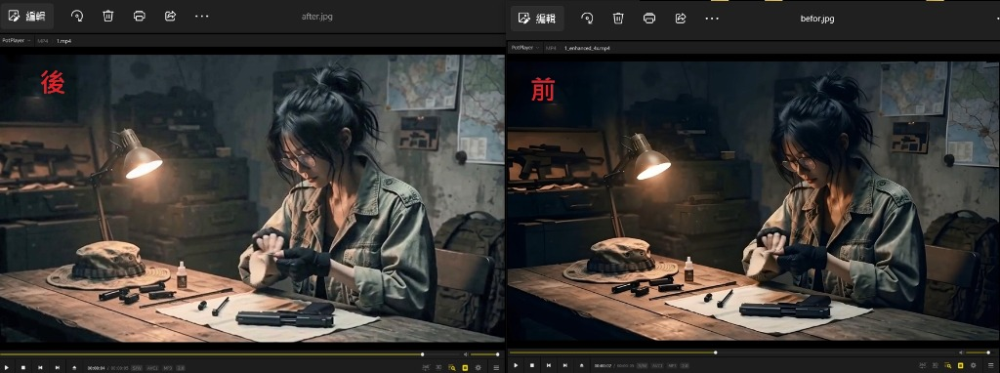
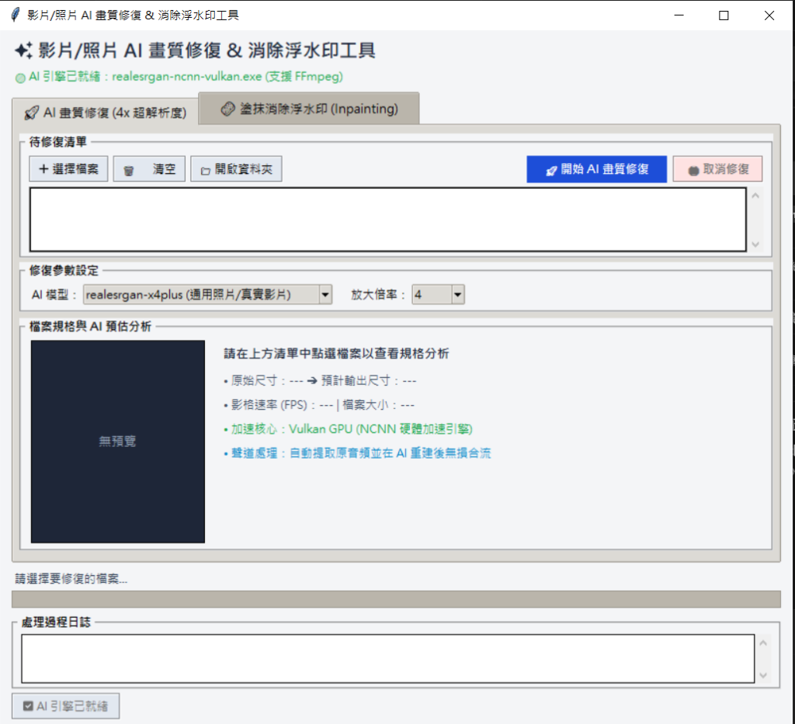

# ✨ 影片 AI 畫質修復 & 消除浮水印工具 (Video AI Enhancer)

<p align="center">
  
  
  
  
</p>

基於 **Real-ESRGAN (NCNN Vulkan)** 與 **FFmpeg** 的一站式輕量級桌面端 AI 工具，支援**影片與照片的 4x 超解析度畫質修復**，以及**互動式塗抹消除浮水印 (Inpainting)**。零門檻、免安裝 PyTorch/CUDA 巨量依賴、全便攜化隨開隨用！

---

## 🎯 效果對比展示 (Before vs After)

> 左圖為 **AI 修復後**（左上角浮水印完全抹除 + 畫質細節重建），右圖為 **修復前**（帶有 RunningHub AI 水印與壓縮失真）。

<p align="center">
  
</p>

- **浮水印完全消失**：牆面陰影、背景紋理無痕融合，絕不留死白或方形色塊。
- **4x 超解析度紋理補全**：髮絲根根分明，金屬零件、衣物布料與木桌紋理皆由神經網路重新生成銳利細節。

---

## 🖥️ 軟體介面預覽 (Interface Preview)

<p align="center">
  
</p>

---

## 🌟 核心特色功能

### 1. 🚀 AI 畫質修復 (4x 超解析度)
- **多模型支援**：內建 `realesrgan-x4plus (通用照片/真實影片)`、`realesrgan-x4plus-anime (動漫二次元風格)`、`realesrnet-x4plus (平滑抗鋸齒)`。
- **自由縮放倍率**：支援 `2x` / `4x` 放大倍率。
- **即時影片規格分析**：自動提取原始影格率（FPS）、解析度並實時推算輸出尺寸（自動標註 2K QHD / 4K UHD / 8K）。
- **即時逐幀進度條**：以 0.3 秒為單位監聽已完成影格，進度實時跳動，絕不卡死！
- **秒級強制取消**：深度進程樹終止機制，放大到一半隨時可中斷並立即釋放 GPU 算力。

### 2. 🧽 塗抹消除浮水印 (Inpainting)
- **直覺塗抹畫布**：支援載入影片（自動提取首幀預覽）與圖片，滑鼠左鍵自由塗抹遮罩。
- **🔍 畫面縮放與平移**：支援滑鼠滾輪放大（最高 500%）與滑鼠右鍵拖曳平移，角落細小 Logo 也能超精準塗抹！
- **可調筆刷與 Undo**：提供 5px~80px 筆刷粗細滑桿，支援一鍵復原 (Undo) 與清空標記。
- **🔗 一鍵聯動 AI 放大**：消除浮水印後，可直接點擊「傳送至 AI 放大修復」，自動切換至 AI 頁面無縫進行 4x 超解析度處理！

### 3. ⚡ 全便攜化與通用硬體加速
- **Vulkan GPU 硬體加速**：支援 NVIDIA、AMD、Intel 所有主流顯卡，運算效率高且無需安裝數十 GB 的 CUDA 與 PyTorch。
- **無損音畫合流**：自動提取原始視訊音軌，AI 重建後無損合併，絕不產生音畫不同步或失真。
- **零黑框執行**：全程後台靜默運算，不會彈出任何惱人的黑色 CMD 命令列視窗。

---

## 🚀 快速啟動

雙擊專案目錄下的：
- **`啟動工具(免黑框).vbs`**（推薦，完全無黑框閃爍）
- 或 **`啟動圖形介面.bat`**

---

## 📦 核心環境一鍵下載

若本機尚未具備 AI 核心或 FFmpeg，軟體支援**零設定全自動下載**：
1. **方式 A**：開啟 UI 後，左下角直接點擊 **「⬇️ 一鍵安裝 AI 引擎」**，程式會在介面內自動下載並解壓（約 20MB Real-ESRGAN + 必要組件）。
2. **方式 B**：在資料夾中直接雙擊：
   ```bash
   一鍵安裝核心.bat
   ```

---

## 📤 推送到 GitHub

本專案已自帶 `.gitignore`（自動排除大於 100MB 的二進位核心檔案與暫存影片，避免觸發 GitHub 100MB 限制）。  
若要將程式碼更新推送至您的 GitHub 倉庫，直接雙擊執行：
```bash
git_push.bat
```

---

## 📄 開源許可
本專案採用 [MIT License](LICENSE) 開源授權。
